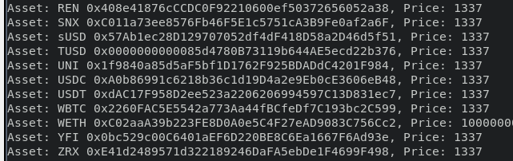

### Solution:

Update AaveOracle.getAssetPrice(s) to support IPyth.getPrice

### Needs:

Mapping an asset address to a  bytes32 ID for Pyth price feeds 

- AaveOracle.getAssetPrice originally expects the asset/token address 
- mapping(address -> AggregatorInterface) is originally how the correct oracle feed is selected

### Considerations:

Error states and handling possible different accuracies
according to the chainlink model necessary

Relevant files:
- [AaveOracle.sol](https://github.com/aave/aave-v3-core/blob/master/contracts/misc/AaveOracle.sol): 
    - Records the price sources (oracles) per asset
    - Chainlink by default
    - supports fallback
- [PriceOracleSentinel.sol](https://github.com/aave/aave-v3-core/blob/master/contracts/protocol/configuration/PriceOracleSentinel.sol)

## Testing

LendingPoolAddressesProvider: 0x038B86d9d8FAFdd0a02ebd1A476432877b0107C8
ReserveLogic: 0xD6C850aeBFDC46D7F4c207e445cC0d6B0919BDBe
GenericLogic: 0x8B5B7a6055E54a36fF574bbE40cf2eA68d5554b3
ValidationLogic: 0xEcc0a6dbC0bb4D51E4F84A315a9e5B0438cAD4f0
LendingPoolImpl: 0x20Ce94F404343aD2752A2D01b43fa407db9E0D00
LendingPool: 0xc3dd7a5CAC7EbAEa8356da9DE8E04ceFE7E5C075
LendingPoolConfiguratorImpl: 0x52d3b94181f8654db2530b0fEe1B19173f519C52
LendingPoolConfigurator: 0xA5EC6385b22DF5501B324b323dd0CCE4a03c536D
StableAndVariableTokensHelper: 0x7e35Eaf7e8FBd7887ad538D4A38Df5BbD073814a
ATokensAndRatesHelper: 0x5bcb88A0d20426e451332eE6C4324b0e663c50E0
AToken: 0x3521eF8AaB0323004A6dD8b03CE890F4Ea3A13f5
DelegationAwareAToken: 0x53369fd4680FfE3DfF39Fc6DDa9CfbfD43daeA2E
StableDebtToken: 0xB00cC45B4a7d3e1FEE684cFc4417998A1c183e6d
VariableDebtToken: 0x58F132FBB86E21545A4Bace3C19f1C05d86d7A22
AaveOracle: 0xa4bcDF64Cdd5451b6ac3743B414124A6299B65FF
LendingRateOracle: 0x5A0773Ff307Bf7C71a832dBB5312237fD3437f9F
AaveProtocolDataProvider: 0x5F6CaC05CDF893f029b29F44d368eAeD40e573B6
WETHGateway: 0x92cfBAB5A86631e9F1A6126b42E01A74eadA61Df
DefaultReserveInterestRateStrategy: 0xe1B3b8F6b298b52bCd15357ED29e65e66a4045fF
rateStrategyAAVE: 0x78Aeff0658Fa67735fBF99Ce7CDB01Fe5D520259
rateStrategyVolatileOne: 0x0C6c3C47A1f650809B0D1048FDf9603e09473D7E
rateStrategyStableOne: 0x06bA8d8af0dF898D0712DffFb0f862cC51AF45c2
rateStrategyStableTwo: 0xb682dEEf4f8e298d86bFc3e21f50c675151FB974
rateStrategyVolatileTwo: 0x1750499D05Ed1674d822430FB960d5F6731fDf64
rateStrategyVolatileThree: 0xE4C10Db67595aF2Cb4166c8C274e0140f7E43059
rateStrategyStableThree: 0x099d9fF8F818290C8b5B7Db5bFca84CEebd2714c
rateStrategyWETH: 0x85bdE212E66e2BAE510E44Ed59116c1eC712795b
rateStrategyVolatileFour: 0xe1B3b8F6b298b52bCd15357ED29e65e66a4045fF
WalletBalanceProvider: 0x0c6b39591433c4B3Ee0f8aE7Db3448ABE9f02109
UiPoolDataProvider: 0xC26eFfa98B8A2632141562Ae7E34953Cfe5B4888
UiIncentiveDataProviderV2V3: 0xa070BaE31a08efb8f9bB98Bb4aDf56fDa3537ceA

### Prices before update

Asset: AAVE 0x7Fc66500c84A76Ad7e9c93437bFc5Ac33E2DDaE9, Price: 116140000000000000
Asset: BAT 0x0D8775F648430679A709E98d2b0Cb6250d2887EF, Price: 349500000000000
Asset: BUSD 0x4Fabb145d64652a948d72533023f6E7A623C7C53, Price: 242572782245147
Asset: DAI 0x6B175474E89094C44Da98b954EedeAC495271d0F, Price: 243070000000000
Asset: ENJ 0xF629cBd94d3791C9250152BD8dfBDF380E2a3B9c, Price: 595852667160095
Asset: KNC 0xdd974D5C2e2928deA5F71b9825b8b646686BD200, Price: 835005311849024
Asset: LINK 0x514910771AF9Ca656af840dff83E8264EcF986CA, Price: 12439010000000000
Asset: MANA 0x0F5D2fB29fb7d3CFeE444a200298f468908cC942, Price: 357870219009603
error with 0x9f8F72aA9304c8B593d555F12eF6589cC3A579A2
Asset: REN 0x408e41876cCCDC0F92210600ef50372656052a38, Price: 238920000000000
Asset: SNX 0xC011a73ee8576Fb46F5E1c5751cA3B9Fe0af2a6F, Price: 4311438474882426
Asset: sUSD 0x57Ab1ec28D129707052df4dF418D58a2D46d5f51, Price: 248320000000000
Asset: TUSD 0x0000000000085d4780B73119b644AE5ecd22b376, Price: 242600000000000
Asset: UNI 0x1f9840a85d5aF5bf1D1762F925BDADdC4201F984, Price: 9705000000000000
Asset: USDC 0xA0b86991c6218b36c1d19D4a2e9Eb0cE3606eB48, Price: 242638355348509
Asset: USDT 0xdAC17F958D2ee523a2206206994597C13D831ec7, Price: 243100000000000
Asset: WBTC 0x2260FAC5E5542a773Aa44fBCfeDf7C193bc2C599, Price: 14312319680289907000
Asset: WETH 0xC02aaA39b223FE8D0A0e5C4F27eAD9083C756Cc2, Price: 1000000000000000000
Asset: YFI 0x0bc529c00C6401aEF6D220BE8C6Ea1667F6Ad93e, Price: 13709447640000000000
Asset: ZRX 0xE41d2489571d322189246DaFA5ebDe1F4699F498, Price: 480300000000000
Asset: xSUSHI 0x8798249c2E607446EfB7Ad49eC89dD1865Ff4272, Price: 4489234702162234

### Forced price "1337"

**It works!**

